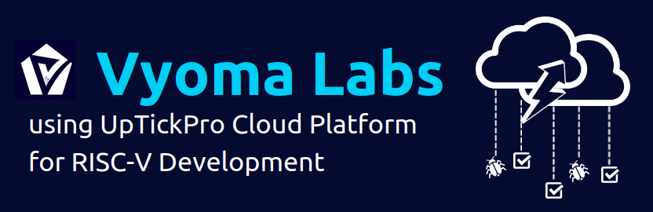

# Semiconductor RISC-V Training Program — Hands-On Labs
### IIT Madras Global · SHAKTI

Afternoon hands-on labs for the RISC-V block of the program. Each day is a
self-contained folder with exercises, a Spike-based run flow, and a short README.

## Environment
- `riscv64-unknown-elf-gcc` — RISC-V toolchain
- `spike` — RISC-V ISA simulator (runs programs bare metal)
- Optional: export `DESIGN_HOME` to also run on the SHAKTI C-CLASS RTL

## Schedule (afternoon sessions)

| Day | Date | Session | Folder |
|-----|------|---------|--------|
| 9  | 3 Jul  | RISC-V Assembly & Simulator Setup | `day9_base_isa_setup/` |
| 10 | 6 Jul  | Base ISA & M Extension            | `day10_base_isa_m_ext/` |
| 11 | 7 Jul  | A/F/D/C Extensions                | `day11_afdc_ext/` |
| 12 | 8 Jul  | CSR Programming                   | `day12_csr_programming/` |
| 13 | 9 Jul  | Interrupts & Exceptions           | `day13_interrupts_exceptions/` |
| 14 | 10 Jul | Pipeline Behaviour Analysis       | `day14_pipeline_analysis/` |
| 15 | 13 Jul | Processor Debugging               | `day15_debugging/` |

## Start here
```bash
cd day9_base_isa_setup/task1_setup
./run.sh
```

## Reference
RISC-V assembly course — Ch. 1–3 recommended pre-reading:
https://riscv-programming.org/book/riscv-book.html

---

<h2 align="center">Lab Support provided by Vyoma</h2>
<p align="center">
  <a href="https://vyomasystems.com"></a>
</p>
<p align="center">🌐 <a href="https://vyomasystems.com">vyomasystems.com</a></p>
